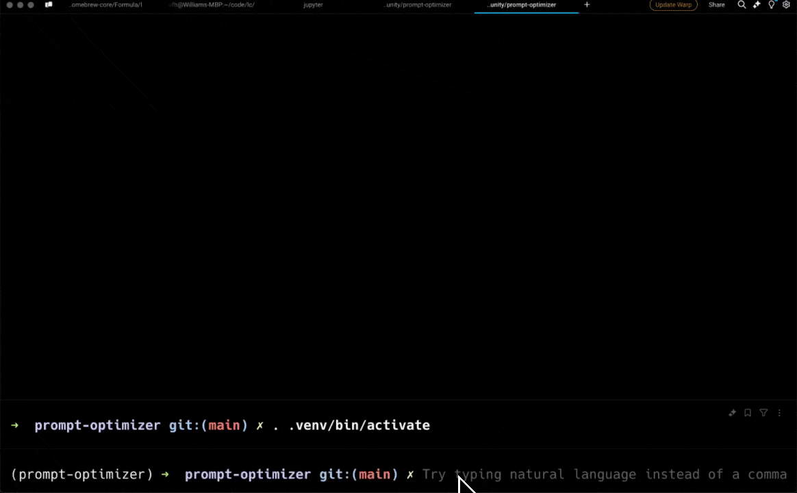

# Promptim

Experimental **prompt** opt**im**ization library.

## Example:

First install the CLI:

```shell
pip install -U promptim
```

And make sure you have a valid [LangSmith API Key](https://smith.langchain.com/) in your environment.

```shell
LANGSMITH_API_KEY=CHANGEME
```

Then, create a task to optimize over. A task defines the dataset, evaluators, and initial prompt to optimize. To create an example "tweet generation" task you can optimize, run the following command:

```shell
promptim create-task  ./my-task my-tweet-task11
```

This will create a dataset named "my-tweet-task1", clone a starter prompt (with the name "my-tweet-task1-starter"), and locally create a directory "my-task" with two files in it.

To optimize your prompt, run the `train` command. If you are using the default optimizer configuration above, you will need to set an Anthropic API key:

```shell
ANTHROPIC_API_KEY=CHANGEME
```

Then optimize your prompt:

```shell
promptim train --task ./my-task/config.json
```

You will see the progress in your terminal.

## Create a custom task

Currently, `promptim` runs over individual **tasks**. A task defines the dataset (with train/dev/test splits), initial prompt, evaluators, and other information needed to optimize your prompt.

```python
    name: str  # The name of the task
    description: str = ""  # A description of the task (optional)
    evaluator_descriptions: dict = field(default_factory=dict)  # Descriptions of the evaluation metrics
    dataset: str  # The name of the dataset to use for the task
    initial_prompt: PromptConfig  # The initial prompt configuration.
    evaluators: list[Callable[[Run, Example], dict]]  # List of evaluation functions
    system: Optional[SystemType] = None  # Optional custom function with signature (current_prompt: ChatPromptTemplate, inputs: dict) -> outputs
```

Let's walk through the example ["tweet writer"](./examples/tweet_writer/task.py) task to see what's expected. First, view the [config.json](./examples/tweet_writer/config.json) file

```json
{
  "optimizer": {
    "model": {
      "model": "claude-3-5-sonnet-20241022",
      "max_tokens_to_sample": 8192
    }
  },
  "task": "examples/tweet_writer/task.py:tweet_task"
}
```

The first part contains confgiuration for the optimizer process. For now, this is a simple configuration for the default (and only) metaprmopt optimizer. You can control which LLM is used via the `model` configuration.

The second part is the path to the task file itself. We will review this below.

```python
def multiple_lines(run, example):
    """Evaluate if the tweet contains multiple lines."""
    result = run.outputs.get("tweet", "")
    score = int("\n" in result)
    comment = "Pass" if score == 1 else "Fail"
    return {
        "key": "multiline",
        "score": score,
        "comment": comment,
    }


tweet_task = dict(
    name="Tweet Generator",
    dataset="tweet-optim",
    initial_prompt={
        "identifier": "tweet-generator-example:c39837bd",
    },
    # See the starting prompt here:
    # https://smith.langchain.com/hub/langchain-ai/tweet-generator-example/c39837bd
    evaluators=[multiple_lines],
    evaluator_descriptions={
        "under_180_chars": "Checks if the tweet is under 180 characters. 1 if true, 0 if false.",
        "no_hashtags": "Checks if the tweet contains no hashtags. 1 if true, 0 if false.",
        "multiline": "Fails if the tweet is not multiple lines. 1 if true, 0 if false. 0 is bad.",
    },
)
```

We've defined a simple [evaluator](https://docs.smith.langchain.com/evaluation/how_to_guides/evaluation/evaluate_llm_application#use-custom-evaluators) to check that the output spans multiple lines.

We have also selected an initial prompt to optimize. You can check this out [in the hub](https://smith.langchain.com/hub/langchain-ai/tweet-generator-example/c39837bd).

By modifying the above values, you can configure your own task.

## CLI Arguments

The CLI is experimental.

```shell
Usage: promptim [OPTIONS] COMMAND [ARGS]...

  Optimize prompts for different tasks.

Options:
  --version  Show the version and exit.
  --help     Show this message and exit.

Commands:
  create-task  Create a new task directory with config.json, task file,...
  train        Train and optimize prompts for different tasks.

```

```shell
Usage: promptim train [OPTIONS]

  Train and optimize prompts for different tasks.

Options:
  --task TEXT                  Task to optimize. You can pick one off the
                               shelf or select a path to a config file.
                               Example: 'examples/tweet_writer/config.json
  --batch-size INTEGER         Batch size for optimization
  --train-size INTEGER         Training size for optimization
  --epochs INTEGER             Number of epochs for optimization
  --debug                      Enable debug mode
  --use-annotation-queue TEXT  The name of the annotation queue to use. Note:
                               we will delete the queue whenever you resume
                               training (on every batch).
  --no-commit                  Do not commit the optimized prompt to the hub
  --help                       Show this message and exit.
```

```shell
Usage: promptim create-task [OPTIONS] PATH NAME

  Create a new task directory with config.json, task file, and example
  dataset.

Options:
  --help  Show this message and exit.
```

We have created a few off-the-shelf tasks you can choose from:

- tweet: write tweets
- simpleqa: really hard Q&A
- scone: NLI


```
